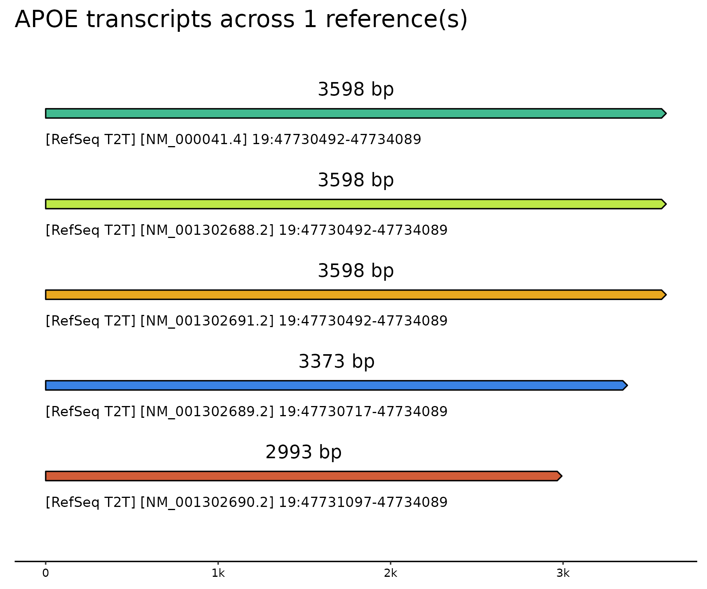

# Download & Compare Genomic Reference Files - Fast! 

**Goal:** A good librarian keeps everything organized. A great librarian also knows the difference between two related items. This workflow downloads and organizes genomic reference files - think FASTA and GTF files for GRCh37 and GRCh38 - from [Ensembl](https://useast.ensembl.org/info/data/ftp/index.html) and [RefSeq](https://ftp.ncbi.nih.gov/genomes/refseq/), and then goes one step further by finding and plotting any differences between them.  
- **Why this matters:** Feature differences between references, such as different gene sequences, can influence downsteam results for alignment, variant calling, and more.

## Highlights
1. **Compare total gene counts across two or more references**: In this example, the total gene counts are plotted for [Ensembl's GRCh38](https://useast.ensembl.org/Homo_sapiens/Info/Annotation), [RefSeq's GRCh38](https://www.ncbi.nlm.nih.gov/refseq/annotation_euk/Homo_sapiens/GCF_000001405.40-RS_2024_08/), and [RefSeq's T2T-CHM13v2.0](https://www.ncbi.nlm.nih.gov/datasets/genome/GCF_009914755.1/). This workflow will also plot total transcript counts, gene and transcript counts per chromosome and per biotype (ex. protein-coding genes). See [plots](./tests/plots) for more.

2. **Compare common genes across two or more references**: In this example, there are 40,000 genes shared among the three references. However, we can quickly see that the two RefSeq references contain ~15,000 genes that the Ensembl reference does not have.

3. **Compare specific genes and transcripts**: In these two examples, the coordinates and lengths of three genes (ADARB2, AFF2, and AFF3) are compared across three references. In addition, the coordinates and lengths of the five transcripts transcribed by APOE are shown for RefSeq T2T only.

## Visual Summary

## Overview
Starting with an easy-to-use [config file](./reference.cfg), this workflow will do the following:

**Script 1 [Py]:**
1. Download files for your selected reference → FASTA and GTF files
2. Create other important files from these downloads → indexes, annotation and BED files
3. Add everything to the master "librarian" → [JSON](tests/references.json) containing all references for all species

**Script 2 [R]:**
**Overall View of References -** Get an understanding of what's in each reference and how two or more compare. The output files from this script will tell you everything you need to know about your references. There's no need to open any file!
1. Plot gene and transcript counts across references, by chromosome, and by biotype (ex. protein-coding)
2. Plot FASTA stats, such as number of ambiguous bases
3. Plot overlapping features, such as common and distinct genes across references  😎
4. Write out an Excel file with counts, plot links, and common and distinct features 😎

**Script 3 [R]:**
**Detailed View of Features -** Zoom in on selected features (genes, transcripts, exons, or CDSs) using [gggenomes](https://thackl.github.io/gggenomes/articles/gggenomes.html). This is a quick way to compare features across multiple references. All you need to do is provide a list of genes, transcripts, or genomic coordinates. Some use cases are:
1. From gene names → Plot genes across references
2. From genomic coordinates → Plot genes across references
3. From gene names → Plot transcripts across references
4. From transcript names → Plot exons across references
5. From transcript IDs → Plot CDSs across references

## Example File: Total Counts

## Example File: Common Genes

## Links to Example Files
1. [Config for Ensembl's GRCh38](tests/configs/Ensembl_GRCh38.cfg)
2. [Master Librarian - references.json](tests/references.json)

## Links to Example Plots
These plots are designed to compare features for two or more references:
1. [Total protein-coding genes - Script 2](tests/plots/gene_types_per_reference.png)
2. [Total protein-coding transcripts - Script 2](tests/plots/transcript_types_per_reference.png)
3. [Total transcripts per chromosome - Script 2](tests/plots/transcript_counts_per_chr.png)
4. [Common transcripts - Script 2](tests/plots/common_transcripts_across_2_references.png)
5. [Genes by coordinates - Script 3](tests/plots/specific_tracks/chr19_47600000_47750000_across_1_references.png)
6. [Exons by transcripts - Script 3](tests/plots/specific_tracks/enst00000252486_nm_000041_4_exons_across_3_references.png)

## FAQ
1. Which files are actually downloaded from Ensembl or RefSeq in script 1?
	- **7 files in total are downloaded from Ensembl or Refseq.** However, not all of these files are the same. Here's how it breaks down:
		- Ensembl and RefSeq (4 common files): 3 FASTA files (genomic, CDS, and protein) + 1 GTF file
		- Ensembl only: 2 more FASTA files (cDNA and ncRNA) + mapping files (ex. Ensembl-RefSeq IDs)
		- RefSeq only: 3 more FASTA files (mRNA, pRNA, and coding proteins)

2. How many references can be compared?
	- **Two or more references can be compared, even for different species.** But keep in mind that Ensembl and RefSeq have different feature identifiers. For genes, Ensembl uses an ENSG* prefix while RefSeq only uses gene names (no IDs). Likewise, for transcripts, Ensembl uses an ENST* prefix while RefSeq uses an NM_* prefix (or XM_* , NR_* , XR_*). **When making comparisons between Ensembl and RefSeq, uses gene names when comparing genes. Transcripts cannot really be compared between Ensembl and RefSeq due to a lack of a common identifier.**

3. What are some things to keep in mind when indexing?
	- Indexing is a crucial step to expedite alignments and for search algorithms to function optimally. However, not all indexes are created equal. **Creating STAR and bowtie indexes are the slowest steps in the workflow, while the STAR index files are the largest (ex. Ensembl's GRCh38 is 27G).**

4. How can I find additional reference files that are not in Ensembl or RefSeq?
	- **Need a different file?** See [UCSC's Table Browser](https://genome.ucsc.edu/cgi-bin/hgTables?command=start)
	- **Need a unique genome?** See [UCSC Public Hubs / GenArk](https://genome.ucsc.edu/cgi-bin/hgHubConnect), which hosts external sources containing exotic genomes.

5. Why does RefSeq have an additional `download_primary_assemblies` step?
	- RefSeq genomes contain patches and alternative chromosomes, which in turn contain duplicate sequences to those found in the primary chromosomes. These should be removed, since they will negatively impact alignment via multi-mapping. I made this decision from an RNA-Seq perspective, since I prefer to work with clean files in which the results are interpretable and not ambiguous.
